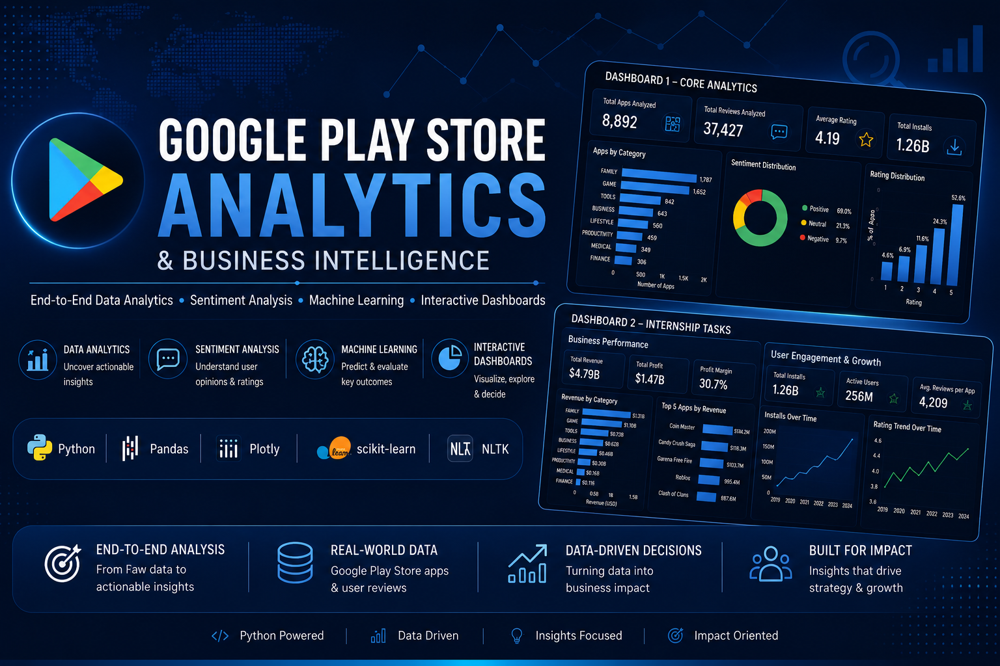
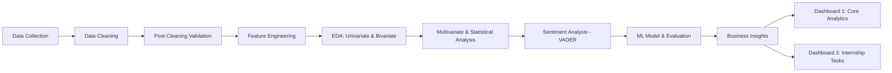
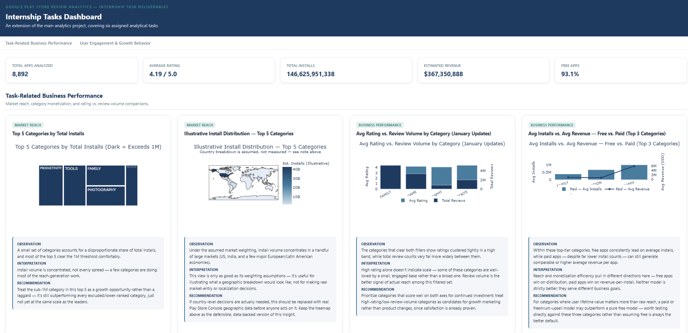
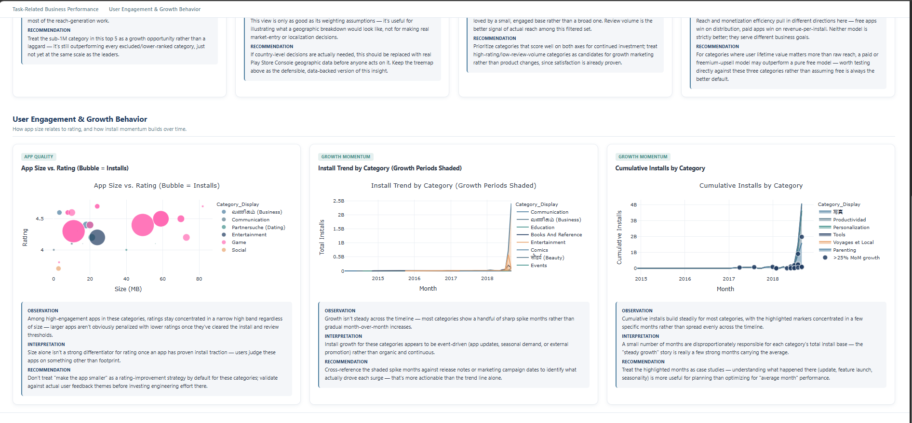

# 📊 Play Store Market & User Sentiment Analytics

<p align="center">
  <em>Turning raw Play Store metadata and user reviews into a decision-ready analytics story.</em>
</p>

<!-- PROJECT BANNER PLACEHOLDER -->
<p align="center">
  
</p>

<p align="center">
  
  
  
  
  
  
</p>

---

## 📌 Executive Project Overview

This project takes two raw Google Play Store data sources — app metadata and user reviews — and turns them into a structured, evidence-backed view of what actually drives app performance on the store. Rather than relying on assumptions like "bigger apps get better reviews" or "paid apps must perform better," every claim in this project is tested against the data using correlation analysis, sentiment scoring, and predictive modeling.

The output isn't just a notebook. It's two interactive HTML dashboards — one covering the core analytics, and one covering six internship-assigned business tasks — built for stakeholders who want answers, not raw numbers.

**At a glance:**

| Metric | Value |
|---|---|
| Apps analyzed (post-cleaning) | 8,892 |
| User reviews scored for sentiment | 37,427 |
| Average app rating | 4.19 / 5.0 |
| Estimated cumulative installs | 146.6 Billion |
| Estimated revenue (paid apps) | $367.35 Million |
| Free apps | 93.1% |

## 📚 Table of Contents

- [Executive Project Overview](#-executive-project-overview)
- [Business Problem](#-business-problem)
- [Project Objectives](#-project-objectives)
- [Dataset Overview](#️-dataset-overview)
- [Technology Stack](#️-technology-stack)
- [Project Workflow](#-project-workflow)
- [Repository Structure](#-repository-structure)
- [Key Features](#-key-features)
- [Data Cleaning & Preprocessing](#-data-cleaning--preprocessing)
- [Exploratory Data Analysis](#-exploratory-data-analysis)
- [Statistical Analysis](#-statistical-analysis)
- [Sentiment Analysis](#-sentiment-analysis)
- [Machine Learning](#-machine-learning)
- [Dashboard 1 Overview](#-dashboard-1-overview)
- [Dashboard 2 (Internship Tasks) Overview](#-dashboard-2-internship-tasks-overview)
- [Key Business Insights](#-key-business-insights)
- [Business Recommendations](#-business-recommendations)
- [Project Screenshots](#️-project-screenshots)
- [Installation Guide](#️-installation-guide)
- [Requirements](#-requirements)
- [How to Run the Project](#️-how-to-run-the-project)
- [Results & Deliverables](#-results--deliverables)
- [Future Improvements](#-future-improvements)
- [Learning Outcomes](#-learning-outcomes)
- [Author](#-author)
- [Acknowledgements](#-acknowledgements)
- [License](#-license)
---

## 🎯 Business Problem

Raw Play Store data doesn't answer much on its own. App metadata arrives as inconsistently formatted text, and user reviews arrive as unstructured opinion — neither is usable for a business decision until it's cleaned, structured, and interrogated.

This project set out to answer three questions that otherwise sit unanswered:

1. **Reach vs. revenue** — Which app categories lead on installs, and is it the same set of categories that leads on estimated revenue?
2. **Sentiment vs. rating** — Does what users write in reviews agree with the star rating they give?
3. **Rating predictability** — Can an app's rating be explained or predicted from measurable attributes like installs, reviews, size, and price?

Without answers to these, category investment, pricing strategy, and quality-improvement effort end up guided by assumption rather than evidence.

---

## 🎯 Project Objectives

**Prepare**
- Clean and standardize raw app metadata and user review data into an analysis-ready form.
- Engineer derived features: log-scaled installs/reviews, rating tiers, estimated revenue, and update year.

**Analyze**
- Explore the dataset through univariate, bivariate, and multivariate analysis.
- Quantify user review sentiment using VADER and test its relationship with star ratings.
- Build and honestly evaluate a predictive model for app rating.

**Deliver**
- Translate all findings into a business-insights narrative and an interactive dashboard.
- Implement six additional internship-assigned analytical tasks as a second, dedicated dashboard.

---

## 🗂️ Dataset Overview

The project draws on two source files describing the Play Store ecosystem from different angles.

| | Play Store Data.csv | User Reviews.csv |
|---|---|---|
| **Grain** | One row per app | One row per review (many rows per app) |
| **Rows** | 10,841 | 64,295 |
| **Columns** | 13 | 5 |
| **Key fields** | App, Category, Rating, Reviews, Size, Installs, Type, Price, Content Rating, Genres, Last Updated, Current Ver, Android Ver | App, Translated_Review, Sentiment, Sentiment_Polarity, Sentiment_Subjectivity |
| **Role** | Backbone of every EDA, statistical, and modeling step | Source for review-level sentiment scoring |

**Post-cleaning dataset size:**

| | Before | After |
|---|---|---|
| App records | 10,841 | 8,892 |
| Scored reviews | 64,295 | 37,427 |

---

## 🛠️ Technology Stack

<table>
<tr>
<td valign="top">

**Language & Environment**
- Python 3.10+
- Jupyter Notebook

</td>
<td valign="top">

**Data Handling**
- Pandas
- NumPy

</td>
<td valign="top">

**Visualization**
- Plotly
- HTML/CSS dashboard export

</td>
</tr>
<tr>
<td valign="top">

**Machine Learning**
- Scikit-learn (Random Forest Regressor)

</td>
<td valign="top">

**NLP / Sentiment**
- NLTK (VADER SentimentIntensityAnalyzer)

</td>
<td valign="top">

**Statistics**
- Pearson correlation analysis

</td>
</tr>
</table>

---

## 🔄 Project Workflow



---

## 📁 Repository Structure

```
google-play-store-analytics/
│
├── data/
│   ├── Play Store Data.csv
│   └── User Reviews.csv
│
├── notebooks/
│   └── Google_Play_Store_Review_Analytics.ipynb
│
├── dashboards/
│   ├── core_analytics_dashboard.html
│   └── internship_tasks_dashboard.html
│
├── reports/
│   └── Google_Play_Store_Review_Analytics_Report.pdf
│
├── assets/
│   ├── banner.png
│   ├── dashboard1_preview.png
│   ├── dashboard2a_preview.png
│   ├── dashboard2b_preview.png
│
├── requirements.txt
├── LICENSE
└── README.md
```

---

## ✨ Key Features

- End-to-end pipeline from raw, inconsistently formatted CSVs to a clean, analysis-ready dataset with documented, re-verified fixes.
- Feature engineering for log-scaled installs/reviews, estimated revenue, and rating tiers.
- Statistical validation via a Pearson correlation matrix across all key numeric metrics.
- Review-level sentiment scoring on 37,427 reviews using VADER.
- A Random Forest Regressor trained to test whether rating is predictable from available metadata, evaluated honestly on held-out data.
- Two fully interactive Plotly-based HTML dashboards — one core analytics view and one covering six internship-assigned business tasks.
- A complete business-insights narrative connecting every chart to a decision, not just a description.

---

## 🧹 Data Cleaning & Preprocessing

<details>
<summary><strong>Click to expand full cleaning breakdown</strong></summary>

### Issues Identified

| Issue | What It Looked Like | Why It Matters |
|---|---|---|
| Missing ratings | 1,474 apps with no Rating value | Rating drives nearly every chart and the prediction model |
| Numbers stored as text | Installs ("10,000+"), Price ("$4.99"), Reviews | Can't sort, sum, or chart a string |
| Inconsistent size units | Mixed MB, KB, and "Varies with device" | Size comparisons are meaningless without one common unit |
| Duplicate rows | 483 fully duplicated app entries | Inflates every count and sum |
| Missing review text | 26,868 reviews with no text | Can't sentiment-score empty text |

### Fixes Applied

- **Missing data:** Dropped rows with missing Rating (not safely imputable). Filled remaining missing values in non-critical categorical columns (Type, Content Rating, Current Ver, Android Ver) with each column's mode, with affected columns explicitly logged. Dropped reviews with no text.
- **Type conversion:** Installs ("10,000+" → 10000), Price ("$4.99" → 4.99), Reviews (string → int).
- **Size standardization:** "19M" → 19.0 MB; "512k" → 0.5 MB; "Varies with device" left as missing rather than guessed.
- **Duplicates & invalid values:** 483 duplicate rows dropped; 1 row with a Rating outside the valid 0–5 range removed.
- **Post-cleaning validation:** Every fix was re-checked with explicit assertions — zero missing values in key columns, zero duplicates, correct numeric types, and zero invalid ratings — so the pipeline fails loudly on bad data rather than silently propagating errors.

</details>

---

## 🔍 Exploratory Data Analysis

- **Category concentration:** FAMILY leads the catalogue by a wide margin.
- **Free vs. paid:** 93.1% of apps are free.
- **Rating distribution:** Right-skewed, clustering between 4.0 and 4.5, median of 4.30.
- **Update activity:** A rising trend in app updates over time.
- **Genre spread:** Top 10 genres largely mirror category concentration.
- **Category leaders diverge:** GAME leads on total installs; FAMILY leads on estimated revenue.
- **Free vs. paid ratings:** Paid apps carry a modestly higher median rating (4.40 vs. 4.30).

---

## 📈 Statistical Analysis

A Pearson correlation matrix was run across all key numeric metrics — Rating, Reviews, Installs, Price, Size, and their log-scaled versions — to check whether visual patterns held up numerically.

- **Confirmed:** Reviews and Installs are, by a clear margin, the most strongly correlated pair — apps with more installs reliably accumulate more reviews.
- **Undercut:** Rating shows only a weak correlation with every other metric in the matrix, including installs, reviews, price, and size.

---

## 💬 Sentiment Analysis

Every review was scored using **VADER**, a rule-based sentiment tool suited to short, informal text like app reviews. Each review received a compound sentiment score from -1 (very negative) to +1 (very positive).

| Example Review | VADER Read |
|---|---|
| "This app is amazing! I love the new features." | Clearly positive |
| "This app is very bad! I hate the new features." | Clearly negative |
| "This app is okay." | Neutral |

**Result:** Across all 37,427 scored reviews, average sentiment came out to 0.34 (moderately positive). But when averaged to the app level and compared against star ratings, the two signals tracked each other only loosely — echoing the weak correlations already found in the statistical analysis.

---

## 🤖 Machine Learning

A **Random Forest Regressor** was trained on Log_Installs, Log_Reviews, Price, Size, and a Free/Paid flag, using an 80/20 train-test split, with performance reported only on unseen data.

| Metric | Result |
|---|---|
| Model | Random Forest Regressor |
| Features | Log_Installs, Log_Reviews, Price, Size, Is_Free |
| R² Score | ≈ -0.036 |
| Most influential feature | Log_Reviews |

**Interpretation:** A near-zero R² is not a modeling failure — it's a confirmation of what the correlation analysis and sentiment comparison already showed. Rating is most likely driven by factors this dataset simply doesn't capture, such as actual app quality, user experience, or crash rate, rather than by installs, reviews, price, or size.

---

## 📊 Dashboard 1 Overview

The core analytics dashboard covers catalogue composition, category leaders, correlation analysis, sentiment distribution, and model results in a single scrollable view.

**Includes:**
- Top 10 App Categories by Count
- Free vs. Paid App Distribution
- Rating Distribution Across the Store
- Top 10 Categories by Total Installs
- Top 10 Categories by Estimated Revenue
- Rating Distribution: Free vs. Paid Apps
- Correlation Between Key App Metrics
- Review Sentiment Score Distribution
- Which Features Matter Most for Predicting Rating

---

## 📊 Dashboard 2 (Internship Tasks) Overview

A dedicated second dashboard covering six internship-assigned analytical tasks, organized into two tabs, each governed by its own business filters and display logic.

**Task-Related Business Performance:**
- Top 5 Categories by Total Installs
- Illustrative Install Distribution — Top 5 Categories (geography-weighted)
- Avg Rating vs. Review Volume by Category (January Updates)
- Avg Installs vs. Avg Revenue — Free vs. Paid (Top 3 Categories)

**User Engagement & Growth Behavior:**
- App Size vs. Rating (Bubble = Installs)
- Install Trend by Category (Growth Periods Shaded)
- Cumulative Installs by Category

**KPI Row:** Total Apps Analyzed, Average Rating, Total Installs, Estimated Revenue, Free Apps %.

---

## 💡 Key Business Insights

| # | Insight | Business Meaning |
|---|---|---|
| 1 | Reach and revenue diverge | GAME leads installs, FAMILY leads revenue — different categories should be evaluated on different tracks |
| 2 | Sentiment and rating don't move together | Written feedback and star ratings capture different aspects of user experience |
| 3 | Paid apps rate modestly higher | 4.40 vs. 4.30 median — real, but too small to use as a standalone pricing signal |
| 4 | Rating resists prediction | Ratings can't be reliably predicted from installs, reviews, price, or size alone |
| 5 | Growth comes in bursts | A small number of months carry a disproportionate share of each category's install growth |
| 6 | Free wins reach, paid can win revenue-per-app | Free apps dominate installs; paid apps can generate comparable or higher revenue per app |

---

## ✅ Business Recommendations

**Act Now** — supported directly by this analysis:
- Evaluate category investment on reach and monetization as two separate tracks, not one combined ranking.
- Stop treating app-size reduction as a default rating fix.
- Track review sentiment and star rating as independent, parallel signals.

**Investigate Further** — directionally supported, needs more groundwork:
- Cross-reference high-growth months against actual release notes or marketing campaign dates.
- Replace the illustrative Task 2 geographic view with real Play Console-sourced country data before market decisions.
- Test a paid/freemium model directly against a free-only baseline in high-LTV categories.

---

## 🖼️ Project Screenshots

<!-- Replace these placeholders with actual screenshot paths from /assets -->

**Dashboard 1 — Core Analytics**
```

```

**Dashboard 2 — Internship Tasks (Business Performance)**
```

```

**Dashboard 2 — Internship Tasks (User Engagement & Growth)**
```

```

---

## ⚙️ Installation Guide

```bash
# Clone the repository
git clone https://github.com/<your-username>/google-play-store-review-analytics.git
cd google-play-store-review-analytics

# Create a virtual environment (recommended)
python -m venv venv
source venv/bin/activate      # On Windows: venv\Scripts\activate

# Install dependencies
pip install -r requirements.txt
```

---

## 📦 Requirements

```
pandas
numpy
plotly
scikit-learn
nltk
jupyter
```

> Note: NLTK's VADER lexicon needs to be downloaded once via `nltk.download('vader_lexicon')` — this is handled in the notebook itself.

---

## ▶️ How to Run the Project

1. Ensure `Play Store Data.csv` and `User Reviews.csv` are placed inside the `data/` folder.
2. Launch Jupyter Notebook:
   ```bash
   jupyter notebook Google_Play_Store_Review_Analytics.ipynb
   ```
3. Run all cells sequentially — cleaning, feature engineering, EDA, sentiment scoring, and modeling execute in order.
4. The notebook generates two standalone HTML dashboards, viewable directly in any browser.

---

## 📦 Results & Deliverables

- ✅ A cleaned, validated dataset of 8,892 apps and 37,427 scored reviews.
- ✅ A full statistical and correlation analysis of key app metrics.
- ✅ A review-level sentiment scoring pipeline using VADER.
- ✅ A Random Forest rating-prediction model, honestly evaluated on held-out data.
- ✅ Two interactive HTML dashboards (core analytics + six internship tasks).
- ✅ A complete written project report with business insights and recommendations.

---

## 🚀 Future Improvements

- Replace the illustrative Task 2 geographic weighting with real, Play Console-sourced country-level install data.
- Segment review text further (e.g., by theme) instead of relying on a single compound sentiment score per review.
- Enrich the rating-prediction model with features this dataset doesn't currently have, such as description text, screenshots, update frequency, or crash/ANR rates.
- Move from a static, notebook-generated HTML dashboard to a live dashboard connected to a refreshing data source.
- Run controlled A/B tests (e.g., paid vs. freemium in a specific high-LTV category) to validate recommendations currently based on observational data.

---

## 🎓 Learning Outcomes

- Structuring a messy, real-world dataset into an analysis-ready form with documented, re-verifiable cleaning logic.
- Applying Pearson correlation analysis to validate visual patterns before treating them as findings.
- Using VADER for rule-based sentiment scoring on short, informal review text.
- Training and, just as importantly, honestly evaluating a machine learning model — including reporting a near-zero R² instead of overstating it.
- Translating raw analysis into a stakeholder-facing narrative and interactive dashboards.

---

## 👩‍💻 Author

**Full Name:** Paakhi Agarwal
**Degree:** BBA (Hons.) — Business Analytics with a Finance Minor
**University:** Symbiosis Centre for Management Studies, Bengaluru
**Role:** Aspiring Data Analyst / Business Analyst

📫 Feel free to connect for feedback, collaboration, or questions about this project.

---

## 🙏 Acknowledgements

- Google Play Store dataset (apps and user reviews) used as the foundation for this analysis.
- NLTK's VADER sentiment analysis tool for review-level scoring.
- Plotly for interactive dashboard visualizations.

---

## 📄 License

This project is released under the [MIT License](LICENSE). Feel free to use, modify, and build upon it with attribution.

---

<p align="center"><em>Built as part of a business analytics internship — turning raw marketplace data into decisions stakeholders can act on.</em></p>
